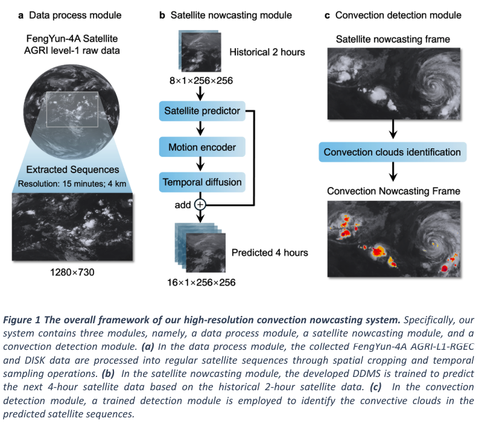
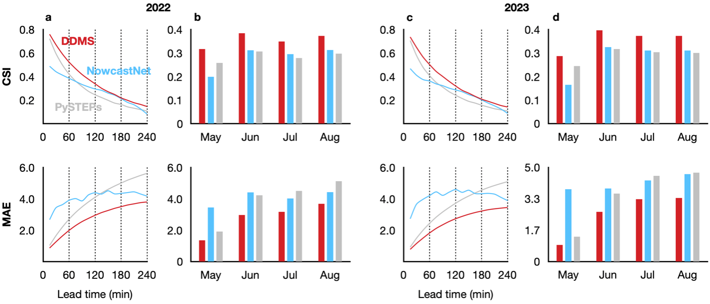

# Summary
Code for Four-hour thunderstorm nowcasting using deep diffusion models of satellite.

Convection (thunderstorm) develops rapidly within hours and is highly destructive, posing a significant challenge for nowcasting and resulting in substantial losses to nature and society. After the emergence of artificial intelligence (AI)-based methods, convection nowcasting has experienced rapid advancements, with its performance surpassing that of physics-based numerical weather prediction and other conventional approaches. However, the lead time and coverage of it still leave much to be desired and hardly meet the needs of disaster emergency response. Here, we propose a deep diffusion model of satellite (DDMS) to establish an AI-based convection nowcasting system. On one hand, it employs diffusion processes to effectively simulate complicated spatiotemporal evolution patterns of convective clouds, significantly improving the forecast lead time. On the other hand, it utilizes geostationary satellite brightness temperature data, thereby achieving planetary-scale forecast coverage. During long-term tests and objective validation based on the FengYun-4A satellite, our system achieves, for the first time, effective convection nowcasting up to 4 hours, with broad coverage (about 20,000,000 km2), remarkable accuracy, and high resolution (15 minutes; 4 km). Its performance reaches a new height in convection nowcasting compared to the existing models. In terms of application, our system operates efficiently (forecasting 4 hours of convection in 8 minutes), and is highly transferable with the potential to collaborate with multiple satellites for global convection nowcasting. Furthermore, our results highlight the remarkable capabilities of diffusion models in convective clouds forecasting, as well as the significant value of geostationary satellite data when empowered by AI technologies. 

## Overall Architecture

## Detailed Structure


## Performance


## Convection Samples
We provide 4-hour convection nowcasting samples of DDMS over different months.


## Citation

If you are interested in our repository or our paper, please cite the following papers:

```
@article{dai2024four,
  title={Four-hour thunderstorm nowcasting using deep diffusion models of satellite},
  author={Dai, Kuai and Li, Xutao and Fang, Junying and Ye, Yunming and Yu, Demin and Xian, Di and Qin, Danyu},
  journal={arXiv preprint arXiv:2404.10512},
  year={2024}
}
```